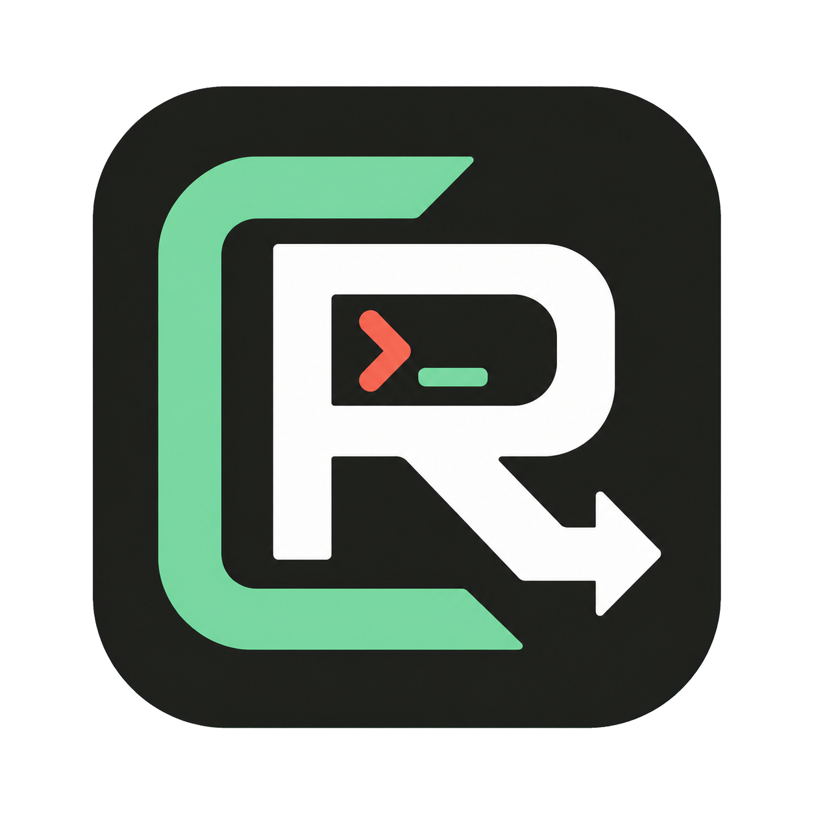

<div align="center">
  
  <h1>CC Router for Windows</h1>
  <p><strong>不做代理，不改 Claude 配置，让每个 Claude Code 会话使用自己的 API 路由。</strong></p>
  <p>A no-proxy, process-isolated Claude Code Provider launcher for Windows.</p>

  <p>
    <a href="https://github.com/NocoldBob/cc-router-windows/actions/workflows/ci.yml"></a>
    <a href="https://github.com/NocoldBob/cc-router-windows/actions/workflows/security.yml"></a>
    <a href="LICENSE"></a>
    <a href="#系统要求"></a>
    <a href="CHANGELOG.md"></a>
  </p>
</div>

> [!IMPORTANT]
> 当前是公开测试版：仅支持 Windows、Claude Code 和 Anthropic 兼容 Provider。
> 推荐使用进程隔离模式。项目不运行 HTTP 代理，也不提供协议转换。

CC Router 从 Windows Credential Manager 读取所选 API Key，把 Provider、模型和
上下文环境变量只注入新启动的 Claude Code 进程。它不处于模型请求路径中，
因此不会转发、读取或记录你的 prompt、代码、模型回答和 Token 用量。

## 为什么使用 CC Router

- **会话隔离**：项目 A 可以使用 DeepSeek，项目 B 同时使用 Kimi，已有终端、
  Codex 和 VS Code 窗口不受影响。
- **无代理直连**：Claude Code 直接请求 Provider 的 Anthropic 兼容接口，不增加
  本地端口、协议转换层或额外请求日志。
- **Windows 原生凭据**：API Key 保存在 Credential Manager；前端只知道凭据是否
  已配置，不会读取或显示真实 Key。
- **修改范围透明**：推荐模式不修改 Windows 用户环境变量和 Claude 配置文件；
  可选持久模式必须确认、写入前备份，并支持回滚。
- **Provider 可编辑**：内置 DeepSeek、Kimi Global 和 Kimi Code 模板，也可以添加
  自定义 Anthropic 兼容 HTTPS Provider。
- **安全导入导出**：Provider JSON、路由状态和备用配置不包含 API Key。
- **VS Code Companion**：可为每个本地 Windows 工作区选择独立 Provider，并通过
  官方 Claude Code 扩展支持的进程 wrapper 启动新会话。

## 适用场景

CC Router 适合主要在 Windows 上使用 Claude Code，希望不同项目同时使用不同
Provider，并且重视 Key 存放位置和配置修改范围的用户。

它不适合需要以下能力的场景：

- OpenAI Responses、Chat Completions 与 Anthropic Messages 之间的协议转换
- 自动故障转移、熔断、请求日志、费用或用量统计
- Codex、Gemini CLI、OpenCode、MCP 和 Skills 的统一管理
- macOS、Linux、云同步或企业集中策略

这些能力不只是尚未完成的功能，也不属于当前产品定位。计划中的工作见
[Roadmap](ROADMAP.md)。

## 工作方式

推荐模式的数据路径很短：

```text
Windows Credential Manager
          |
          | Rust 后端按需读取 Key
          v
CC Router 启动新的 Claude Code 进程
          |
          | 仅该子进程可见的环境变量
          v
Claude Code --------------------> Provider 官方 Anthropic 兼容接口
```

CC Router 关闭后，已经启动的 Claude Code 会话仍保留自己的进程环境；关闭该
Claude Code 窗口后，本次路由自然失效。

## 快速开始

### 1. 准备环境

- Windows 10 或 Windows 11 x64
- 已安装并可正常运行的 [Claude Code](https://docs.anthropic.com/en/docs/claude-code/overview)
- 一个受支持 Provider 的 API Key

### 2. 安装 CC Router

beta 安装包发布在本仓库的 [Releases](https://github.com/NocoldBob/cc-router-windows/releases)
页面，同时提供 SHA-256 校验文件和 GitHub 构建来源证明。发布流程会在全新的
Windows runner 上自动完成静默安装、应用启动和卸载检查。

> [!WARNING]
> 当前安装包没有商业代码签名，Windows 可能显示“未知发布者”或 SmartScreen
> 提示。请只使用本仓库 Release 页面提供的安装包，并在运行前核对 SHA-256。

### 3. 配置并启动

1. 打开 CC Router，选择内置 Provider 或创建自定义 Provider。
2. 检查 Base URL、主模型、快速模型和可选 Agent 参数。
3. 将 API Key 保存到 Windows Credential Manager。
4. 选择工作目录，点击“切换并启动 Claude Code”。
5. 在新会话中运行 `/status`，确认实际 Base URL 和模型。

未填写 Claude CLI 路径时，应用会检查 `PATH`、
`%USERPROFILE%\.local\bin\claude.exe`、`%APPDATA%\npm\claude.cmd` 和 WinGet Links。

## 两种路由模式

| 模式 | 修改范围 | 生命周期 | 建议 |
| --- | --- | --- | --- |
| 切换并启动 Claude Code | 仅新建 Claude Code 子进程 | 关闭该窗口后失效 | **推荐** |
| 设为 Windows 默认路由 | 当前用户的 Windows 环境变量 | 清除、回滚或再次修改前持续存在 | 谨慎使用 |

### 进程隔离模式（推荐）

- 不修改 Windows 用户环境变量
- 不修改 `~/.claude` 或 Claude 配置文件
- 不影响已有终端、Codex 或 VS Code 窗口
- 允许多个不同 Provider 的 Claude Code 会话同时运行

### Windows 默认路由（可选）

持久模式适合希望新终端和重启后的 VS Code Claude Code 插件默认使用同一路由的
用户。应用会在确认后写入相关用户环境变量，并在写入前保存一次可回滚备份。

> [!CAUTION]
> 持久模式会把 API Key 写入用户级 `ANTHROPIC_AUTH_TOKEN`，这是明文 Windows
> 用户环境变量。已有 PowerShell、Claude Code 和 VS Code 不会自动获得新值，
> 必须完全退出后重新启动。

应用管理的环境变量包括：

```text
ANTHROPIC_BASE_URL
ANTHROPIC_AUTH_TOKEN
ANTHROPIC_MODEL
ANTHROPIC_DEFAULT_OPUS_MODEL
ANTHROPIC_DEFAULT_SONNET_MODEL
ANTHROPIC_DEFAULT_HAIKU_MODEL
ANTHROPIC_DEFAULT_FABLE_MODEL
CLAUDE_CODE_SUBAGENT_MODEL
CLAUDE_CODE_EFFORT_LEVEL
CLAUDE_CODE_AUTO_COMPACT_WINDOW
CLAUDE_CODE_MAX_CONTEXT_TOKENS
```

## 内置 Provider

| Provider | Anthropic Base URL | 主模型 | 快速模型 | 最后验证 | 官方资料 |
| --- | --- | --- | --- | --- | --- |
| DeepSeek | `https://api.deepseek.com/anthropic` | `deepseek-v4-pro[1m]` | `deepseek-v4-flash` | 2026-08-19 | [Claude Code 接入](https://api-docs.deepseek.com/quick_start/agent_integrations/claude_code) |
| Kimi Global | `https://api.moonshot.ai/anthropic` | `kimi-k3` | `kimi-k2.6` | 2026-08-19 | [模型文档](https://platform.kimi.ai/docs/models) |
| Kimi Code | `https://api.kimi.com/coding/` | `k3[1m]` | `k3-256k` | 2026-08-19 | [Claude Code 接入](https://www.kimi.com/code/docs/third-party-tools/claude-code.html) |

内置值是可编辑模板，不是对第三方服务长期可用性的承诺。Kimi Code 的
`k3[1m]` 写法仅用于 Claude Code 环境变量场景；实际可用模型和上下文取决于
会员档位。模板依据：

- [DeepSeek 接入 Claude Code](https://api-docs.deepseek.com/quick_start/agent_integrations/claude_code)
- [Kimi Code 接入 Claude Code](https://www.kimi.com/code/docs/third-party-tools/claude-code.html)

Provider 更新模型或参数后，可以直接在 UI 中修改并保存模板。

应用会显示内置模板的最后验证日期和官方文档入口。编辑过任一技术参数后，界面会
明确说明该验证日期只适用于默认值，不会把本地自定义值标记为官方已验证。

## VS Code Companion

仓库中的 `vscode-extension` 提供 Windows 专用的 VS Code Companion。扩展在
Activity Bar 中提供原生侧边栏，直接显示当前工作区路由、Provider、模型和凭据
状态，并可以一键启动官方 Anthropic Claude Code 扩展的新会话。状态栏与命令面板
入口继续保留。

发布的 VSIX 内置同版本的 CC Router 桌面安装器。用户安装扩展后无需预先单独下载
桌面程序；首次启用时确认一次，扩展会为当前 Windows 用户静默安装并打开桌面管理
工具。已有安装会被自动发现，也保留手动选择程序路径的恢复入口。

扩展不会把 API Key 写入 VS Code 的用户设置、工作区设置或扩展状态。它配置
Claude Code 官方提供的 `claudeProcessWrapper`，由随扩展打包的
`cc-router-helper.exe` 在启动新进程时从 Windows Credential Manager 读取 Key。
桌面端和扩展共享的 `providers.json` 只包含非敏感 Provider 元数据。

当前 Companion beta 仅支持本地 Windows 工作区，不支持 WSL、SSH 和 Dev
Containers。已有 Claude Code 会话不会热切换，选择结果仅应用于新会话。

## 启动就绪检查

桌面路由控制区会在启动前检查 Claude CLI、Credential Manager 凭据、工作目录和
路由配置。它还会列出当前进程中可能影响 Claude Code 的环境变量名；隔离启动时
这些变量会被清理或覆盖。诊断仅向前端返回变量名，不返回、记录或显示变量值。

## 安全边界

- API Key 不写入 `localStorage`、Provider JSON、项目文件或路由备份 JSON。
- Rust 后端不会通过 IPC 把 Key 返回给 WebView 前端。
- Key 不出现在应用日志、PowerShell 参数、路由状态或导出文件中。
- Provider 设置保存在本机 WebView 的 `localStorage`，其中不包含 API Key。
- 进程隔离模式不修改用户环境或 Claude 配置；持久模式的明文环境变量风险会在
  执行前明确提示。

用户选择的 Provider 仍会收到 Claude Code 发送的 prompt、代码和工具输出。
Credential Manager 和进程环境也不能抵御已经以同一 Windows 用户权限运行的
恶意程序。完整数据流和威胁边界见[安全模型](docs/SECURITY_MODEL.md)；漏洞请按照
[安全策略](SECURITY.md)私下报告，不要在 Issue 中提交真实 Key 或敏感诊断信息。

## 从源码构建

### 系统要求

- Node.js 20 或更高版本
- pnpm 10.33.0
- [Microsoft C++ Build Tools](https://visualstudio.microsoft.com/visual-cpp-build-tools/)，
  安装 `Desktop development with C++` 工作负载
- [Rust stable MSVC toolchain](https://www.rust-lang.org/tools/install)
- Microsoft Edge WebView2（现代 Windows 10/11 通常已经安装）

### 开发与构建

```powershell
git clone https://github.com/NocoldBob/cc-router-windows.git
cd cc-router-windows
pnpm install --frozen-lockfile

# Web 预览，不提供 Credential Manager 和本地进程能力
pnpm dev

# Tauri 桌面开发版
pnpm desktop:dev

# 生成 NSIS 安装包
pnpm desktop:build

# 检查并生成 VS Code VSIX
pnpm vscode:check
pnpm vscode:package
```

### 验证

```powershell
pnpm lint
pnpm test
pnpm build

cd src-tauri
cargo fmt --all -- --check
cargo test --locked
cargo check --locked
```

## 项目结构

```text
src/
  App.tsx                 Provider 编辑和路由控制 UI
  defaultProviders.ts     内置 Provider 模板
  nativeRouter.ts         Tauri IPC 边界
  routerCommands.ts       脱敏 PowerShell / JSON 备用输出

src-tauri/src/
  commands.rs             Claude Code 启动和本地命令
  credentials.rs          Windows Credential Manager
  provider_store.rs       桌面端和扩展共享的无密钥 Provider 配置
  system_env.rs           Windows 用户环境读写
  backup.rs               无明文 Key 的路由备份与回滚
  models.rs               路由校验和 IPC 数据结构

vscode-extension/
  src/                    Companion 状态栏、命令和 helper 调用
  bin/                    打包时生成的 Windows helper
  desktop/                打包时生成的同版本桌面安装器
```

## 参与项目

- 提交 Issue 或 Pull Request 前阅读[贡献指南](CONTRIBUTING.md)。
- 查看已知变化和版本记录：[CHANGELOG.md](CHANGELOG.md)。
- 查看公开计划：[ROADMAP.md](ROADMAP.md)。
- 维护者和 AI 编程助手应先阅读[产品定位与维护交接](docs/PRODUCT_STRATEGY_AND_HANDOFF.md)。

涉及凭据、环境变量、PowerShell、IPC 或备份兼容性的改动必须增加回归测试。
自动化测试不得使用真实 API Key，也不得修改维护者的 Windows 用户环境。

## License 与非隶属声明

CC Router 使用 [MIT License](LICENSE) 发布。

本项目与 Anthropic、DeepSeek、Moonshot AI 或其他 Provider 没有隶属、授权或官方
合作关系。Claude、Claude Code、DeepSeek、Kimi、Windows 及其他产品名称和商标
归各自权利人所有。
