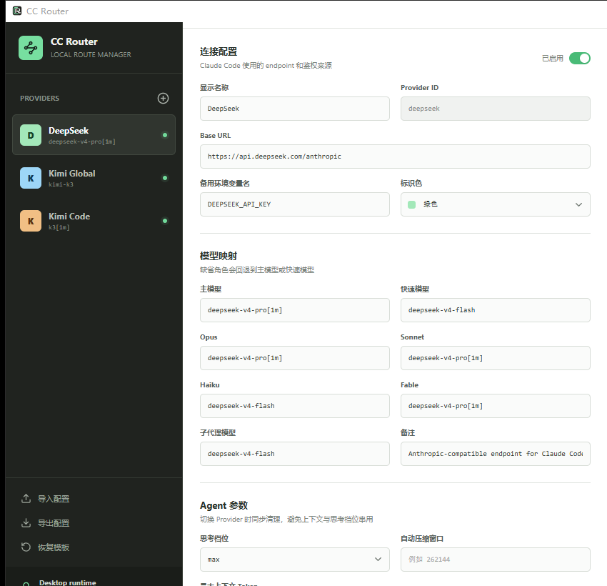
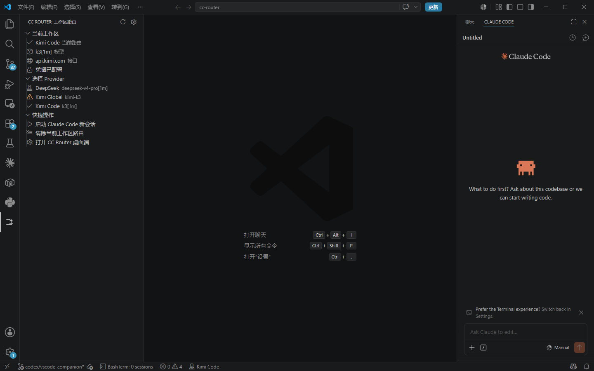

# 在 VS Code 中使用 CC Router 与 Claude Code

本指南适用于希望在本地 Windows VS Code 工作区中，通过 CC Router 为 Anthropic
官方 Claude Code 扩展选择 DeepSeek、Kimi 或自定义 Anthropic 兼容 Provider 的用户。

CC Router Companion 不运行 HTTP 代理。它为每个工作区保存 Provider 选择，并在
启动新的 Claude Code 子进程时注入对应路由。API Key 始终保存在 Windows
Credential Manager 中，不会写入 VS Code 设置或项目文件。

## 使用前准备

- Windows 10 或 Windows 11 x64。
- 本地 VS Code 工作区。WSL、SSH 和 Dev Containers 暂不支持。
- 一个可用的 Provider API Key。
- Anthropic 官方 `Claude Code` VS Code 扩展。
- `CC Router Companion` VS Code 扩展。

`CC Router Companion` 已声明依赖官方 Claude Code 扩展。正常从 Marketplace 安装时，
VS Code 会处理依赖；如果 Claude Code 没有自动安装，请在扩展市场搜索
`Anthropic Claude Code` 并确认发布者为 Anthropic。

## 第一步：安装 CC Router Companion

### 从 VS Code Marketplace 安装（推荐）

1. 打开 [CC Router Companion 商店页面](https://marketplace.visualstudio.com/items?itemName=NocoldBob.cc-router-companion)。
2. 点击 **Install / 安装**，允许页面打开 VS Code。
3. 在 VS Code 中确认安装，完成后根据提示重新加载窗口。

也可以直接在 VS Code 中按 `Ctrl+Shift+X` 打开扩展面板，搜索
`CC Router Companion`，确认发布者为 `NocoldBob` 后点击安装。从 Marketplace
安装可以自动接收后续版本更新。

### 从 VSIX 手动安装（备用）

1. 从本项目 [GitHub Releases](https://github.com/NocoldBob/cc-router-windows/releases)
   下载最新的 `cc-router-companion-*.vsix`。
2. 在 VS Code 扩展面板右上角点击 `...`。
3. 选择 **从 VSIX 安装... / Install from VSIX...**。
4. 选择下载的 VSIX，等待 VS Code 显示安装成功。
5. 根据提示重新加载 VS Code 窗口。

首次启用时，插件会询问是否安装内置的 CC Router 桌面管理工具。点击
**立即安装 / Install Now** 即可，无需预先单独下载桌面安装包。安装范围是当前
Windows 用户，默认路径为：

```text
%LOCALAPPDATA%\Programs\CC Router\cc-router.exe
```

如果电脑上已经安装过 CC Router，插件会自动发现并使用现有安装。安装器当前没有
商业代码签名，Windows 可能显示未知发布者提示，请只使用本仓库 Release 提供的文件。

## 第二步：配置 Provider 与 API Key

首次安装完成后，CC Router 桌面端会自动打开。也可以随时在 VS Code 左侧打开
**CC Router**，然后点击 **打开 CC Router 桌面端**。



1. 在左侧选择 DeepSeek、Kimi Global、Kimi Code，或点击 `+` 创建自定义 Provider。
2. 检查 Base URL、主模型、快速模型和其他模型映射。
3. 在 API Key 区域只粘贴原始令牌，不要添加 `Bearer`，也不要粘贴说明文字或引号。
4. 点击保存 API Key，将其写入 Windows Credential Manager。
5. 点击页面顶部的 **保存配置**，生成供 VS Code 扩展读取的无密钥 Provider 目录。

共享配置只包含 Provider 名称、Endpoint、模型和启用状态。API Key 不会进入该文件。

## 第三步：为当前工作区选择 Provider

先在 VS Code 中打开一个本地文件夹或 `.code-workspace`，然后点击活动栏中的
**CC Router** 图标。



侧栏分为三个区域：

| 区域 | 作用 |
| --- | --- |
| 当前工作区 | 显示已选择的 Provider、主模型、Endpoint 和凭据状态 |
| 选择 Provider | 点击一个 Provider，将它绑定到当前工作区 |
| 快捷操作 | 启动新会话、清除工作区路由或打开桌面端 |

Provider 左侧图标的含义：

| 图标 | 含义 |
| --- | --- |
| 对勾 | 当前工作区正在选择该 Provider |
| 服务器 | Provider 可用，凭据已配置 |
| 警告 | 尚未配置 API Key，需要打开桌面端处理 |

不同工作区可以同时选择不同 Provider。例如，工作区 A 使用 DeepSeek，工作区 B
使用 Kimi Code，它们不会相互覆盖。

## 第四步：启动 Claude Code 新会话

1. 在 **选择 Provider** 区域点击目标 Provider。
2. 首次使用时，确认让 CC Router 配置 Claude Code 的进程 wrapper。
3. 点击 **启动 Claude Code 新会话**。
4. Claude Code 面板打开后开始对话。

也可以按 `Ctrl+Shift+P` 使用以下命令：

```text
CC Router: Select Provider for Workspace
CC Router: Start Claude Code Session
CC Router: Clear Provider for Workspace
CC Router: Open Desktop App
CC Router: Repair or Update Desktop App
CC Router: Restore Previous Claude Wrapper
```

只有通过 CC Router 新启动的 Claude Code 会话会获得所选路由。已经打开的会话不会
热切换；切换 Provider 后必须点击 **启动 Claude Code 新会话**。

## 第五步：确认路由已经生效

可以用以下方式交叉确认：

1. VS Code 状态栏显示当前 Provider 名称。
2. CC Router 侧栏的“当前工作区”显示预期模型和 Endpoint。
3. 在新 Claude Code 会话中运行 `/status`，检查实际 Base URL 和模型。
4. 运行 `/model`，确认当前模型名称与桌面端的主模型配置一致。

如果 Claude Code 仍显示旧 Provider，先关闭旧会话，再通过 CC Router 的
**启动 Claude Code 新会话**按钮重新创建会话。

## 修改模型或新增 Provider

1. 点击侧栏中的 **打开 CC Router 桌面端**。
2. 修改模型映射，或添加自定义 Anthropic 兼容 HTTPS Provider。
3. 点击桌面端的 **保存配置**。
4. 回到 VS Code，点击 CC Router 侧栏标题栏中的刷新按钮。
5. 重新选择 Provider，并启动新会话。

Claude Code 对话框中的上下文标识来自所选模型名称，例如 `k3[1m]`。需要调整时应在
桌面端修改模型配置，而不是在已有 Claude Code 会话中寻找 CC Router 设置。

## 常见问题

### 侧栏显示“尚未找到共享 Provider 配置”

点击 **安装或启动 CC Router 桌面端**，配置至少一个 Provider，然后点击桌面端的
**保存配置**。回到 VS Code 后点击刷新。

如果桌面端已经保存，但刷新后界面完全不变，通常是插件发现并打开了以前安装的旧版
桌面端。点击侧栏中的 **修复或更新桌面端**，或在命令面板运行：

```text
CC Router: Repair or Update Desktop App
```

确认后，插件会关闭正在运行的旧桌面端，使用 VSIX 内置版本覆盖安装并重新打开。
Provider 配置会保留，API Key 仍在 Windows Credential Manager 中。修复后若没有自动
恢复，请在桌面端再次点击 **保存配置**，再刷新侧栏。

桌面端和 VS Code 必须使用同一个 Windows 用户账户运行。共享文件位于：

```text
%APPDATA%\local.ccrouter.desktop\providers.json
```

该文件只包含 Provider 名称、Endpoint 和模型等非敏感配置，不包含 API Key。

### 提示没有配置 API Key

打开桌面端，选择对应 Provider，重新保存原始 API Key。不要输入 `Bearer` 前缀、
空格、中文说明或整段聊天内容。

### 出现 `Header 'Authorization' has invalid value`

通常是 API Key 字段中混入了 `Bearer`、引号、换行或说明文字。删除旧凭据，只粘贴
Provider 提供的原始令牌并重新保存。

### 切换 Provider 后模型没有变化

路由只对新进程生效。不要继续复用旧对话，使用侧栏的 **启动 Claude Code 新会话**。

### 桌面端没有自动打开

点击侧栏中的 **打开 CC Router 桌面端**。插件会依次检查运行中的窗口、默认安装
目录和 Windows 卸载注册表；仍未找到时，可以手动选择 `cc-router.exe`。

### Claude Code 已配置其他 wrapper

插件会在替换前提示，并记录原来的设置。需要退出 CC Router 时，运行
`CC Router: Restore Previous Claude Wrapper` 恢复原配置。

## 卸载与恢复

卸载扩展前，建议先运行 `CC Router: Restore Previous Claude Wrapper`。

VS Code 扩展和桌面管理工具是两个独立安装项。移除扩展不会自动删除桌面端，也不会
删除 Windows Credential Manager 中的 Provider 凭据。桌面端可在 Windows
“已安装的应用”中卸载；凭据应在桌面端逐个删除，或使用 Windows 凭据管理器处理。

## 安全边界

- 扩展状态、VS Code 设置和工作区文件中不保存 API Key。
- 原生 helper 只在启动新的 Claude Code 子进程时读取所选凭据。
- CC Router 不运行 HTTP 代理，不读取或记录 prompt、代码、回答和 Token 用量。
- 所选 Provider 仍会接收 Claude Code 发出的模型请求。
- 当前只支持本地 Windows 工作区。

更多边界说明见[安全模型](SECURITY_MODEL.md)。
